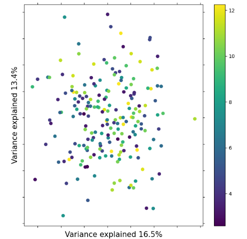
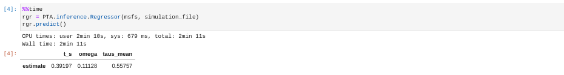

# Phylogeographic Temporal Analysis (PTA)
## Inferring shared demographic response using machine learning

> ### **Questions:**
>
> - What exactly do I do with all these PTA simulations?
> - How does machine learning (ML) simulation-based inference work?
> - What do the ML results *tell* me?
> 
> ### **Learning objectives:**
>
> - Understand ML classification and regression.
> - Implement ML inference with toy data and pre-baked simulations.
> - Plot and interpret ML inference.
> - Understand the steps to reproduce this analysis with your own data on your own computer.

## Table of Contents
* [PTA API mode for ML inference](<#pta-api-mode-in-a-jupyter-notebook>)
* [ML Classification](<#ml-classification>)
* [ML Regression](<#ml-regression>)
* [Running PTA on your own data](<#running-pta-on-your-own-data>)

### Accessing a jupyter notebook on the cloud

Click the '+' sign to open the App Launcher again. This time under the "Notebook"
heading click "Python 3 (ipykernel)" to launch a new jupyter notebook.


Jupyter notebooks allow to run code 'interactively' and to display figures
inside a web-based interface. PTA is written in python and we will use the
notebook interface to look at some plots and access the PTA 'inference'
methods. We don't assume knowledge of python here, we will only be making
a few calls to the PTA toolkit.

Jupyter notebooks are organized into **cells** where you can write code and
then run the code within each cell. You can make new cells with the '+' button
in the notebook toolbar, and you can run cells with the 'play' button. We'll
practice this quite a bit now.

Now we're going to a little setup in the first notebook cell. Copy and paste
this into the cell and then press the 'play' button. What do you think will
happen here?

```
%matplotlib inline
import PTA

simulation_file = "example_data/MG-Snakes/MG-Snakes-SIMOUT.csv"
```
Nothing happened? No, no, no! Lots happened, just nothing that we can see!
* `%matplotlib inline` - This tells the notebook to actually show us figures we plot.
* `import PTA` - Tell the notebook to load the PTA module so we can use it.
* `simulation_file = "example_data/MG-Snakes/MG-Snakes-SIMOUT.csv"` - Make the
variable `simulation_file` refer to a file in the filesystem.

> #### **NOTE: Using pre-baked simulations**
> You may have noticed that we aren't using the `default_PTA/MG-Snakes-SIMOUT.csv`
> file that we just created. This is because simulation-based ML inference like
> this requires a **lot of simulations** (far more than we have time for everyone
> to generate themselves in this workshop). Instead we are using a much bigger,
> pre-baked simulation file that we created in advance using exactly the same
> parameters as we just used moments ago, so these simulations are directly
> comparable to those you just ran, there's just way more of them! We have stored
> this big simulation file _inside_ the [PTA github repository](https://github.com/isaacovercast/PTA/tree/master/example_data/MG-Snakes),
> in the `example_data` directory, so that everyone can easily access it.

### PTA API mode in a jupyter notebook

OK, now we have the pre-baked simulation data 'loaded', what are we going to do
with it? First things first, it's good practice to check your simulations
to make sure the "make sense", i.e. did the parameters we chose result in
simulations with meaningfully diffent outputs?

#### Sanity checking your simulations
Checking whether your simulations 'make sense' is sometimes not so straightforward.
Fortunately, PTA has a `plotting` module with some helper functions to make this
super easy! **Create a new cell in your notebook, type the following code and run it.**

> **NOTE:** `t_s` is the sampled time of co-demographic change. It is sampled from
> the range that we specified in the `tau` parameter in the params file.

```
PTA.plotting.plot_simulations_pca(simulation_file, target="t_s")
```


> #### **NOTE: Fixing it when plots don't show**
> You might see the first time you try to run a command to plot a figure that
> nothing actually happens. This is because plotting is a little _goofy_ inside
> jupyter notebooks (for reasons that are both too boring and too complicated to go
> into). You can always fix this by simply **re-running the cell that includes
> `%matplotlib inline`, and then running the cell with the plot code again.**

In this plot we are using **Principal component analysis (PCA)** which is a
standard dimension-reduction technique. Each point in the plot represents the
data from one simulation and all the points are colored by their `t_s` value.
You can see the points are arranging themselves in a gradient based on `t_s`,
and this is a good indication that the simulations 'make sense.' Similar values
of `t_s` will generate similar output data and different values of `t_s` will
generate different output data. This is good, it is the kind of variation the ML
inference will key in on.

> #### **Challenge: Plot the PCA with different 'target' parameters**
> Look back at the 'parameters' in the column header of the MG-Snakes-SIMOUT.csv
> file. Choose one that you think might show differences in the simulations.
> Try to stick with the ones in the first 11 columns as these are the ones with
> variation in our particular simulations. First, make sure you are clear on what
> this parameter *means*, and if you have questions talk with your partner or ask
> one of the instructors. Next, modify the call to `plot_simulations_pca` to use
> this new parameter as the 'target'. What do you see in the PCA? Is there
> clear separation of the simulations based on the selected target parameter?
> Think about why this might be. If you have more time try to find the parameter
> that generates the best separation in the data. What is it?

Lets quickly look at some simulations with **bad** parameters, so you can see
what simulations look like that don't 'make sense'.



Notice here how there's no _coherence_ in the plot based on `t_s` values.
Everything is kind of all over the place. This is an indication that there
is not good information in the simulations to differentiate `t_s` values.

> #### **Question: Why would some parameters generate 'bad' simulations?**
> To generate these bad simulations we used very small `Ne` values with
> respect to the size of `tau`. Why would this generate simulations with no
> information?

### ML classification

**How many populations co-expanded synchronously?** <- This is the motivating
question for ML 'classification' (or 'model selection' as it's sometimes called).
In ML classification we consider a categorical **target** (or 'response') variable
and we attempt to **classify** which category our empirical data belongs to.
In this case our categorical target variable is `zeta_e` (the _effective_ number
of co-expanding populations).

PTA includes an `inference` module that takes care of a bunch of the ML bookkeeping
and simplifies ML inference from simulations and empirical data. For this
exercise we'll use a simulated mSFS with a known `zeta_e` value of 8, and we'll use
the pre-baked simulation file that we already loaded in previously. In a new
notebook cell type the following commands and run it:

```
msfs = "example_data/MG-Snakes/sim-empirical-msfs-z_e-8.txt"
cla = PTA.inference.Classifier(msfs, simulation_file)
cla.predict()
```

It will think for a while and then print results to the screen. The results are a
vector of classification probabilities for each of the possible `zeta_e` values.
Larger values indicate higher prediction probability. Still, it's a little tricky
to evaluate by eye.

```
(          zeta_e
 estimate       7,
          0    1    2     3     4     5     6     7     8     9   ...    12  \
 zeta_e  0.0  0.0  0.0  0.02  0.02  0.03  0.07  0.16  0.07  0.14  ...  0.03   
 
           13    14    15    16   17    18    19    20    21  
 zeta_e  0.04  0.01  0.04  0.04  0.0  0.08  0.07  0.03  0.02  
```

> #### **Question: Why are these results different from yours?**
> In all likelihood the results you see here are different from those you
> will get in your own analysis. Why might this be?

### Interpreting ML classification results

The vector of classification probabilities can be difficult to eyeball,
particularly when there are so many `zeta_e` values (the results get
truncated). We provide a solution for visualizing classification results
with the `plot()` function of `PTA.Classifier`. Open a new cell and run
the plot command: `cla.plot()`


Now it's a little easier to see there are peaks in prediction probability
at 7 and 9 with most of the _weight_ of the prediction probability
centered around 8. Standard practice in these kinds of things is to
take the **mode** of the distribution as the point estimate. Using this
method we would say of these results, **the most probable `zeta_e` for this
mSFS is 7.**

Typically one would want to be more careful in drawing conclusions from this
result, taking into account **prediction uncertainty** for example. This is
something to think about, but not something we can get into detail about in
this short course.

> **Activity: Attempt to predict `zeta_e` values for mystery simulations**
> Time allowing, you may wish to try to classify some simulated mSFS with
> _unknown_ (to you) `zeta_e` values. There exists a directory called
> `example_data/MG-Snakes/sim-empirical-msfs/` which contains 20 mystery
> mSFS simulated with random `zeta_e` values. Choose one of these and in
> a new notebook cell try to re-run the classification procedure we just
> completed. The **key** containing the true `zeta_e` values is in that
> same directory in the file `zeta-values.txt`. Don't peek until you have
> a guess for your mSFS! How close did you get?

<!--
# Writing zeta values from a df to a file with index values
with open("zeta-values.txt", 'w') as outfile:
    outfile.write("idx\tzeta_e\n")
    outfile.write("\n".join(["{idx}\t{zeta}".format(idx=idx, zeta=zeta) for idx, zeta in enumerate(zetas.values)]))

# Writing simulated msfs in proper format to a file with corresponding index
for idx in range(len(msfss)):
    msfs = pd.DataFrame(msfss.iloc[idx])
    msfs.T.to_csv("sim-empirical-msfs/sim-empirical-msfs-{idx}.csv".format(idx=idx), index=False, sep=" ")
-->

> #### **NOTE: Evaluating classification uncertainty**
> Collectively you may have found that some values of `zeta_e` are 'easier'
> to classify accurately than others. This is because there is inherent **uncertainty**
> in the classification process, and this uncertainty is not uniform across `zeta_e`
> values. In other words, some `zeta_e` values are classified more accurately
> while others are classified with more uncertainty. We can actually
> _systematically_ evaluate uncertainty per `zeta_e` value using **cross-validation**
> and then plotting a **confusion matrix** to display the results. You can see an
> example of this here: [ML Classification Confusion Matrix](img/Inference-ConfusionMatrix.png).
> PTA includes methods for performing this cross-validation and plotting confusion
> matrices, but the exploration of this is beyond the scope of this short workshop.
> Details may be found in the online documentation.

### ML regression

**When did the co-expanding populations change in size?** <- This is the motivating
question for ML 'regression' (or 'parameter estimation'). In ML regression we
consider a continuous target variable (e.g. `t_s`) and attempt to **estimate**
the value of this target variable that is most probable given the empirical data.

**Note:** The simulated `t_s` value for the `sim-empirical-msfs-z_e-8.txt` was 0.398.

```
%%time
rgr = PTA.inference.Regressor(msfs, simulation_file)
rgr.predict()
```

> #### **NOTE: jupyter notebook magics - `%%time`**
> The first line of the last set of commands (`%%time`) is a **magic** command
> inside jupyter notebooks which tells it to tell you how long it takes to run
> the commands inside this cell. This 'magic' has to be the first line in the
> cell and when you run the cell it'll time everything that happens within it
> and report the resulting time after it finishes. Magic!




### Interpreting ML regression results


### Running PTA on your own data

