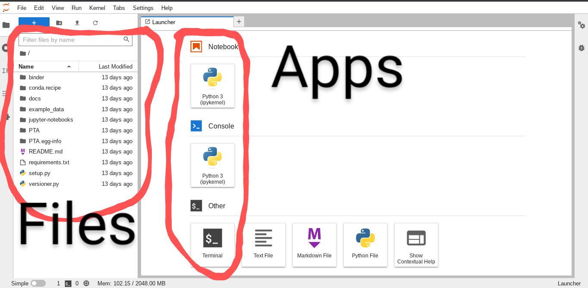
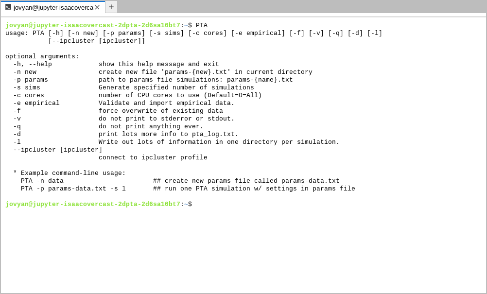
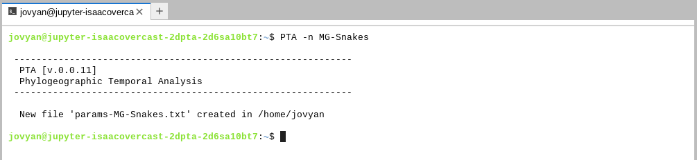
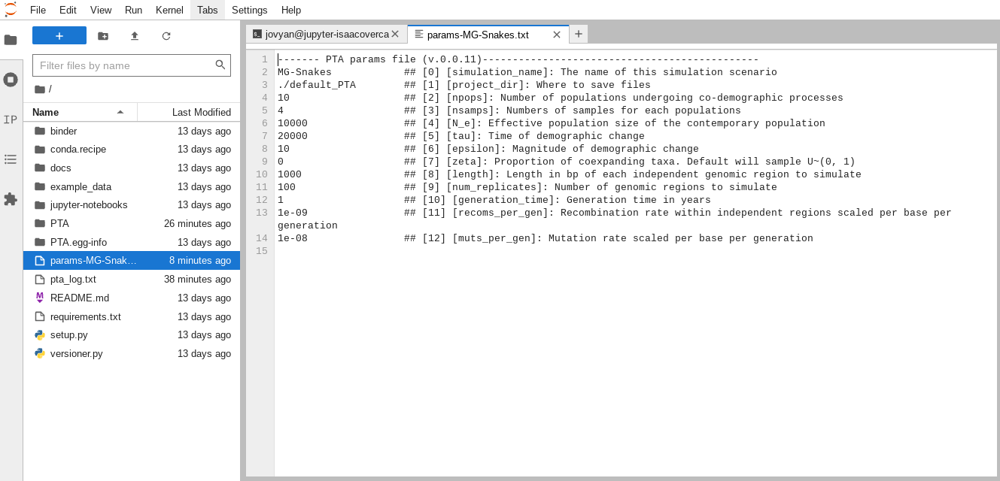
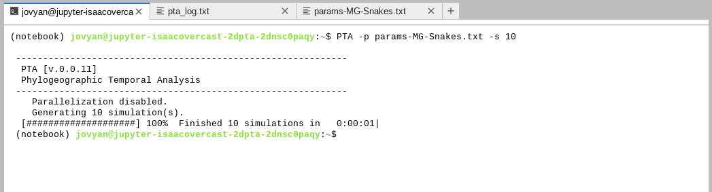
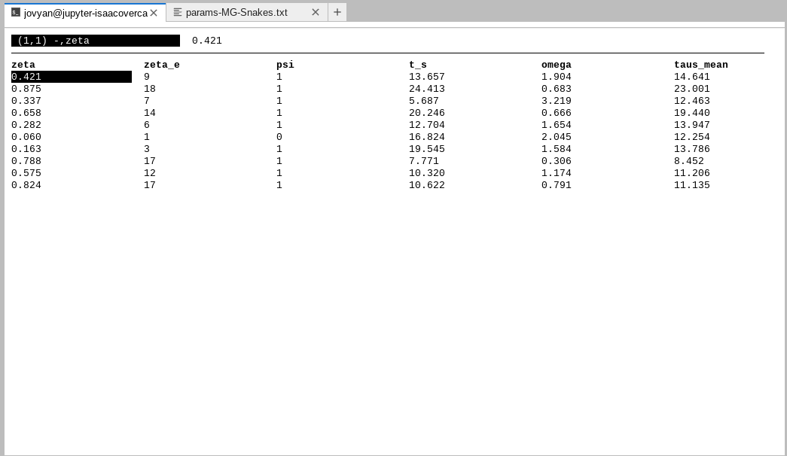

# Phylogeographic Temporal Analysis (PTA)
## Simulating community-scale co-demographic histories

> ### **Questions:**
>
> - How do I run PTA simulations?
> - What parameters can I cange and how do I change them?
> - What do the simulations results look like?
> 
> ### **Learning objectives:**
>
> - Run PTA simulations in the cloud.
> - Create, view, and edit the PTA parameters file.
> - Understand key model parameters.
> - Place prior ranges on model parameters.
> - View and interpret simulation outputs.

## Table of Contents
* [Launch PTA](<#launch-pta-in-the-cloud>)
* [Create and edit a new params file](<#create-and-edit-a-new-params-file>)
* [Running PTA simulations](<#running-pta-simulations>)
* [Inspecting simulation results](<#inspecting-simulation-results>)

### Launch PTA in the cloud
For the purpose of this workshop we are running PTA using **Binder**,
which allows for running github repositories in a free, small
and isolated cloud compute instance. This allows us to side-step the (boring)
installation process and operate in a homogeneous computing environment.  
**Click the link below to launch PTA in a new tab.**

[](https://mybinder.org/v2/gh/isaacovercast/PTA/master)

> #### **NOTE:** Binder instances are *ephemeral*!
> The down-side of Binder is that the virtual machines they provide are
> _ephemeral_, meaning that if you leave it sitting long enough or if you
> close your tab, everything you have done will be lost. For the purpose of
> a workshop this is totally fine because we'll be using toy data and all
> the steps to reproduce your work will be documented on this page. **For the
> purpose of real work you will not want to use Binder** (small amount of
> resources and inability to save your work), so at the end of the workshop
> we will provide instructions on how to install PTA and perform analysis
> on your own computer or HPC system.
>
> That all being said, Binder is still really cool and useful. ;)

After Binder launches you'll be presented with the JupyterLab interface,
which consists of a 'file browser' and an 'app launcher'.


Start by launching a **Terminal** app, which will bring up a command line
interface (CLI). Type `PTA` and push enter and you'll see the PTA "Help" message:



This will show several optional arguments for running PTA, and at the bottom
it gives the simplest command-line usage, which involves two steps:
* Creating a 'params' file
* Running simulations

So, lets start by creating a params file!

### Create and edit a new params file

All PTA simulations are controlled by a 'params' file which contains all the
settings relevant to the _biological_ processes. The logic of differentiating
between parameters in the params file and CLI arguments is to separate the details
that are relevant to the _biology_ (params) from the details that are relevant
to the _execution of the simulations_ (CLI arguments). You can share a params file
with somebody else and they can run simulations on their own computer using
CLI arguments that are relevant to the resources available to them (e.g. number of
CPU cores) and the simulations they generate will be _comparable_ to those you
have generated on your own computer. The params file encapsulates all the
biologically relevant details of the simulations. Let's make one now by running PTA
with the `-n` flag and specifying a name for our params file (required).



> #### **NOTE: On the importance of naming files:**
> Here we will use Arianna's Malagasy snake system as inspiration, so we call
> our params file `MG-Snakes`. In your own work you should use names for your
> params files that are meaningful for your system. Also, as usual, **spaces are
> forbidden in params files names**.

You can see the newly created file pops up in the file browser on the left side.
Double-clicking on the new `params-MG-Snakes.txt` will pop open this file in a
simple text editor interface.



You can see there are (currently) 12 model parameters which describe various
aspects of the demographic model and the size and shape of the data to simulate.
It can seem a little daunting at first, so lets start with something simple:
`npops`, or the number of 'populations' to simulate for our co-demographic
analysis. This is simple because typically we will *know* how many populations
there are in our data, so we can just plug in that number for this parameter.

> **NOTE:** By **'populations'** here what we mean to indicate are the number of
> independent lineages in the analysis, not specifically 'populations' _per se_.
> The number of `npops` could represent species or subspecies or true populations,
> the taxonomic level isn't so important as their independence as demographic
> units within the analysis.

Thinking further in this way we can break the parameters down into two
categories: **things that we know** and **things that we want to know**. Let's
start with 'things that we know.'

#### Things that we know: Parameters that determine the shape and size of the data
The **shape and size of the data** are things that we know coming into the
analysis. By 'shape and size' we mean everything having to do with the data
that you have in hand in coming to the analysis: number of populations, number
of samples per population, length and number of RADSeq loci, and so on. We specify
everything that we **know** about the data to constrain the model to generate
simulated data that is as directly comparable to our observed data as possible.

Now let's edit this file to more closely resemble Arianna's Malagasy snake
data. In the text window change the following values:
```
21                  ## [2] [npops]: Number of populations undergoing co-demographic processes
150                 ## [8] [length]: Length in bp of each independent genomic region to simulate
0                   ## [11] [recoms_per_gen]: Recombination rate within independent regions scaled per base per generation
```
> **Question:** Why might we be setting `recombs_per_gen` to 0 here?

#### Things that we want to know: Parameters that determine the demographic histories to explore
The **demographic history** is the unknown process that generated the patterns
in the observed data. What we **do not know** parameters values that determined
this process. In order to **infer** these parameters we must express our
uncertainty about their values by placing **prior search ranges** on them.

For the purpose of this brief tutorial we will focus on only inferring two key
model parameters: the proportion of coexpanding taxa [ζ (zeta)] and the timing
of co-expansion [τ (tau)]. In practice one might also explore several of the other
parameters detailed below, but for computational efficiency we'll limit ourselves
for now. Edit the following lines in the 'params-MG-Snakes.txt':
```
1e5-5e5              ## [5] [tau]: Time of demographic change
0                    ## [7] [zeta]: Proportion of coexpanding taxa. Default will sample U~(0, 1)
```
> **NOTE:** In the above `1e5` is a standard **scientific notation**
> shortcut to indicate `1*10^5` or `100,000`.

> #### **NOTE:** The meaning of key model parameters
> **Ne**          - Effective population size of the contemporary population\
> **τ (tau)**     - Time of demographic change in years before present\
> **ε (epsilon)** - Magnitude of size change backwards in time (ε<1 expansion; ε>1 contraction; ε=1 constant size)\
> **ζ (zeta)**    - The proportion of co-expanding taxa

When it's finished, your file should look like this:
```
------- PTA params file (v.0.0.11)----------------------------------------------
MG-Snakes            ## [0] [simulation_name]: The name of this simulation scenario
./default_PTA        ## [1] [project_dir]: Where to save files
21                   ## [2] [npops]: Number of populations undergoing co-demographic processes
4                    ## [3] [nsamps]: Numbers of samples for each populations
10000                ## [4] [N_e]: Effective population size of the contemporary population
1e5-5e5              ## [5] [tau]: Time of demographic change
10                   ## [6] [epsilon]: Magnitude of demographic change
0                    ## [7] [zeta]: Proportion of coexpanding taxa. Default will sample U~(0, 1)
150                  ## [8] [length]: Length in bp of each independent genomic region to simulate
100                  ## [9] [num_replicates]: Number of genomic regions to simulate
1                    ## [10] [generation_time]: Generation time in years
0                    ## [11] [recoms_per_gen]: Recombination rate within independent regions scaled per base per generation
1e-08                ## [12] [muts_per_gen]: Mutation rate scaled per base per generation
```

After you are done choose **File->Save Text** to save your changes. Now we are
ready to run some simulations!

> #### **Challenge: Run 10 simulations**
> Using the `PTA -h` help message, see if you can figure out how to
> run `10` simulations using the params file we just created. Take a few
> minutes if you need, and try not to peek at the answer below. ;)

### Running PTA simulations

If you had luck with the challenge you must have found the `-s` command-line
argument to indicate the number of simulations to run. When running simulations
PTA will give a nice progress bar to show you things are running:



> #### **NOTE: Running parallel simulations**
> You might have noticed in running the simulations that PTA reports `Parallelization
> disabled.` This gives you a hint that parallelization is possible! But we don't
> need or want to use this on Binder because you only get 1 core anyway, so it
> wouldn't improve things to run simulations in parallel. If you run PTA on your
> on computer or HPC you can use the `-c` argument to indicate the **number of
> CPU cores** to run on, and PTA will automatically split simulations across all
> these cores. Magic.

OK! So now we ran 10 PTA co-demographic simulations, now what? Well, now first
lets take a look at the simulation output to get a better idea of what kind of
data the model generates.

### Inspecting simulation results

All PTA outputs go in a directory which is specified by the `project_dir` param
in the params file (which by default is `default_PTA`. The simulated output file
shares its name with the params file, so it's easier to identify which
simulations came from which params. Putting that all together the output file for
the simulations we just ran will be: `default_PTA/MG-Snakes-SIMOUT.csv`.

Let us inspect this file using '[tabview](https://github.com/TabViewer/tabview)',
a simple csv file viewer which is not natively installed on linux, but which we
have included in the binder install for the purpose of making this easier for the
workshop. Now open the SIMOUT file with `tabview default_PTA/MG-Snakes-SIMOUT.csv`.




