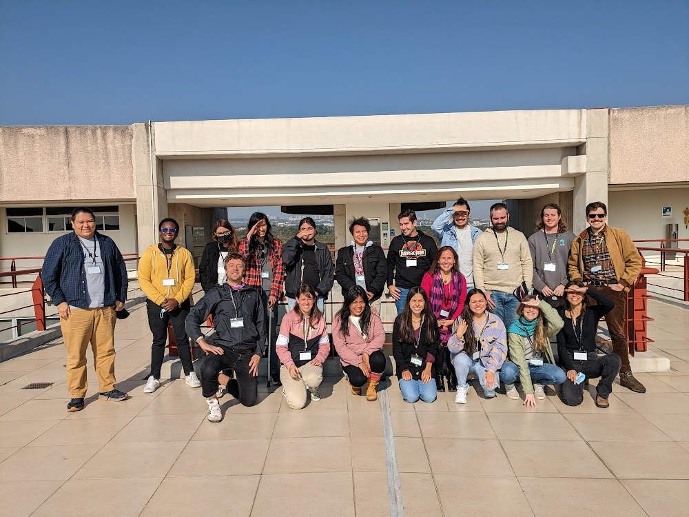
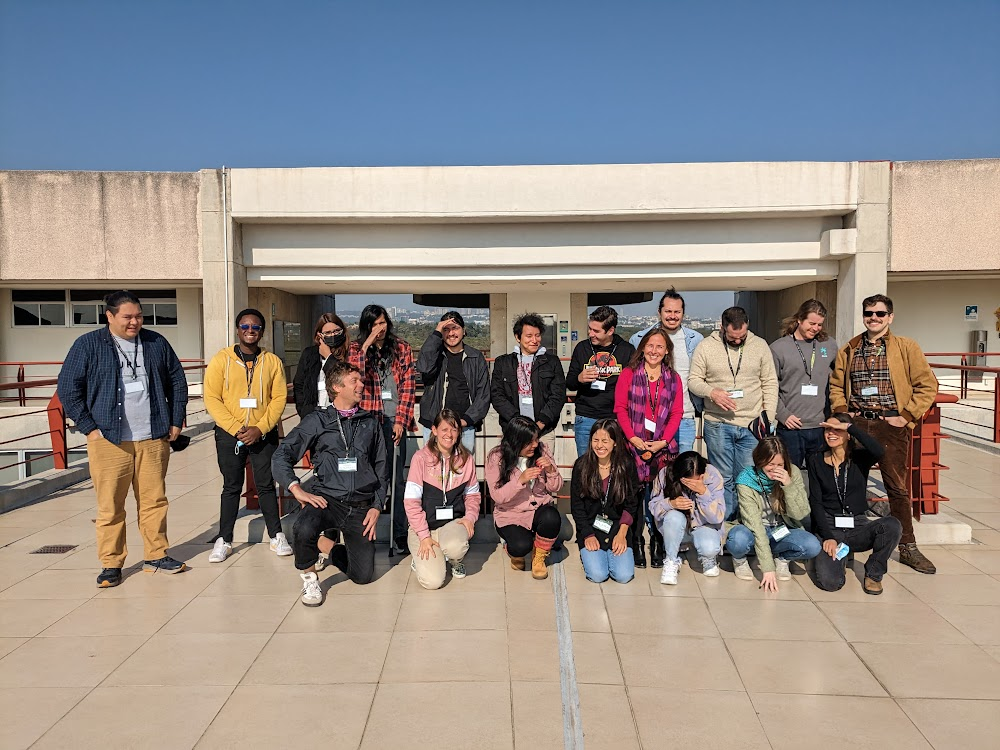

# Welcome to CompPhylo 2023 - Mexico City Edition

## Workshop Location and Date
January 13, 2023 (10h-14h + break)  
[SSB Standalone Meeting (2023)](https://www.ib.unam.mx/ib/ssb2023/)  
TBD, UNAM CU Campus  
CDMX

## Workshop Synopsis/Goals

**Phylogeographic Temporal Analysis (PTA): Model based comparative phylogeography with machine learning**

Species that occupy the same geographic extent (i.e. 'co-distributed species') are
subject to the same changes in environment and geography (e.g. cycles of glaciation,
uplift of mountain ranges, reduction or expansion of suitable habitat due to
changing precipitation regimes, etc.). Estimating the extent to which co-distributed
species undergo similar evolutionary, demographic and distributional histories as
a result of changes in shared abiotic conditions is the domain of comparative
phylogeography (Arbogast & Kenagy, 2001; Gutiérrez-García & Vázquez-Domínguez, 2011;
Edwards et al., 2022). Originally, statistical comparative phylogeographic methods
emerged during the era of single-locus data (e.g.Hickerson et al., 2007) and soon
expanded to account for multi-locus data on the order of handfuls to dozens of loci
(e.g. Huang et al., 2011; Overcast et al., 2017). Such methods, while statistically
robust and feasibly applied to Sanger-like data, are computationally intractable in 
the face of contemporary massive next-generation sequencing datasets (e.g. RADSeq;
Andrews et al., 2016), which can often encompass thousands to tens of thousands of
independent loci.Accordingly, new comparative phylogeographic methods have been
developed to perform inference on such RADSeq or even whole genome-scale datasets
by utilizing either suites of summary statistics (Gehara et al., 2017) or aggregated
(joint) site frequency spectra (Xue & Hickerson, 2017). In this proposed workshop we
will present one such method, Phylogeographic Temporal Analysis (PTA), which combines
advances in the computational performance of large-scale (genome-wide) coalescent
simulations (Kelleher et al., 2016; Kelleher & Lohse, 2020) with the power of machine
learning inference (e.g. scikit-learn; Pedregosa et al., 2011), all within a simple,
user friendly, and reproducible python-based jupyter notebook environment. Given
genome-scale data for multiple individuals of multiple co-distributed species, PTA
implements a hierarchical simulation-based machine learning approach to estimate the
degree of concordance in demographic response (e.g. the number of co-expanding or
co-contracting species), as well as the timing and magnitude of such shared demographic changes.

The learning outcomes of this workshop will include: 1) understanding the fundamental
motivation for comparative phylogeographic inference; 2) identifying and manipulating
key parameters of comparative phylogeographic models; 3) simulating subgenomic or genomic
data for multiple co-distributed species; 4) using supervised machine learning for model
classification and parameter estimation. In this workshop we will proceed through all the
steps necessary to analyze a typical comparative phylogeographic dataset within a jupyter
notebook environment,allowing researchers to generate documented and easily reproducible
workflows, and providing a simple interface for generating publication-ready plots of
results. This workshop will be geared toward practicing field biologists with little or
no computational experience. Workshop attendees will need to bring a laptop computer.

## Organisers/Instructors
  - Isaac Overcast, University of Maine
  - Ella Vázquez-Domínguez, Instituto de Ecología, UNAM
  - Arianna Kuhn, Virginia Museum of Natural History

## Schedule/Workshop Structure

* [Background on comparative phylogeography](https://docs.google.com/presentation/d/1OY2Rvom6PWhvxjgQbiff5WIfrRZ_zM29rT5eUgfdxbI) **[1 hr]**
  * Why do we do this? How?
  * What kinds of questions can we ask and answer?
  * Examples from the literature.
* [Running PTA Simulations](PTA_Simulations.md) **[1.5 hr]**
  * Running simulations with the PTA comparative phylogeographic model
  * Reviewing some of the key model parameters and outputs.
* [Hands-on w/ ML Inference](PTA_Inference.md) **[1.5 hr]**
  * Machine learning inference using simulations and toy empirical data.

## CompPhylo Mexico City 2023 Group Photo

