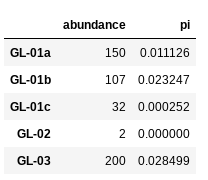

# MESS (Massive Eco-Evolutionary Synthesis Simulations) - Part II

This is the second part of the MESS tutorial in which we introduce the API mode
using jupyter notebooks. In this tutorial we'll walk through the entire simulation 
and analysis process. This is meant as a broad introduction to familiarize 
users with the general workflow, and some of the parameters and terminology. 
We will use as an example in this tutorial the __??????__ data set from
__?????__. However, you can follow along with one of the other example
data sets if you like and although your results will vary the procedure will 
be identical. 

## MESS Part II Outline
* [Crash course in machine learing](#ML-Intro)
* [Setting up and connecting to a notebook server on the cluster](#NB-Cluster-Setup)
* [Create and parameterize a new MESS Region](#Create-MESS-Region)
* [Run MESS simulations in API mode](#Simulate-MESS-API)
* [ML assembly model classification](#MESS-API-Classification)
* [ML parameter estimation](#MESS-API-Regression)
* [Free time to experiment with other example datasets](#Example-Datasets)

Each grey cell in this tutorial indicates a command line interaction. 
Lines starting with `$ ` indicate a command that should be executed 
in a terminal connected to the cluster, for example by copying and 
pasting the text into your terminal. Elements in code cells surrounded 
by angle brackets (e.g. <username>) are variables that need to be 
replaced by the user. All lines in code cells beginning with \#\# are 
comments and should not be copied and executed. All other lines should 
be interpreted as output from the issued commands.

```bash
## Example Code Cell.
## Create an empty file in my home directory called `watdo.txt`
$ touch ~/watdo.txt

## Print "wat" to the screen
$ echo "wat"
wat
```

<a name="ML-Intro"></a>
## Crash course in machine learing
Some stuff here about intro to machine learning and random forests.
Megan will do 20-25 Minutes of this.

<a name="NB-Cluster-Setup"></a>
## Setting up and connecting to a notebook server on the cluster
Lets get set up and connected to our notebook server on the cluster again. If 
you get stuck you might review the [jupyter notebook troubleshooting page]("../Jupyter_Notebook_TLDR.html").

In the juypter browser window navigate to `~/work/MESS` and choose "New->Notebook->Python 3"

<a name="Import-example-data"></a>
## Download and examine example data
We will be using as an example dataset of community-scale COI sequences 
(~500bp) and densely sampled abundances for the spider community on the island 
of La Reunion, an overseas department of France, which is  the largest of the 
Mascarene islands, located in the Indian Ocean approximately 1000 km from 
Madagascar. The data we will be using was collected and published by Emerson 
et al (2017). For this exercise, we will just grab and use the formatted data 
from the MESS github repository. For further instruction on properly 
formatting and converting raw data into MESS-ready format see the [MESS raw data handling page]("MESS_process_raw_data.html").

In a new cell in your notebook you can download the Reunion spider data like this:

```bash
!wget https://raw.githubusercontent.com/messDiv/MESS/master/empirical_data/Reunion_spiders/spider.dat
```
**NB:** The `!` prior to the command here indicates that the jupyter notebook
should interpret this as a bash command executed at the command line. This is a
handy way of executing bash commands from within the notebook environment, rather
than returning to a terminal window on the cluster. It's just a nice shortcut.

Now make a new cell and import MESS and pandas (which is a python data analysis
library), and read in the data you just downloaded.

```
import MESS
import pandas as pd
spider_df = pd.read_csv("spider.dat", index_col=0)
spider_df[:5]
```

**NB:** Importing pandas as `pd` is pretty cannonical. It makes typing out
pandas commands shorter because you can reference it as `pd` rather than `pandas`.
It's syntactic suger, but pretty standard.

**NB::** The final line in the above command asks python to display the first 5 rows of
the `spider_df` dataframe. It should look like this:




<a name="Create-MESS-Region"></a>
## Create and parameterize a new MESS Region

<a name="Simulate-MESS-API"></a>
## Run MESS simulations in API mode

<a name="MESS-API-Classification"></a>
## ML assembly model classification

<a name="MESS-API-Regression"></a>
## ML parameter estimation

<a name="Example-Datasets"></a>
## Free time to experiment with other example datasets

## References

Emerson, B. C., Casquet, J., López, H., Cardoso, P., Borges, P. A., Mollaret, N., 
... & Thébaud, C. (2017). A combined field survey and molecular identification
 protocol for comparing forest arthropod biodiversity across spatial scales. 
Molecular ecology resources, 17(4), 694-707.
